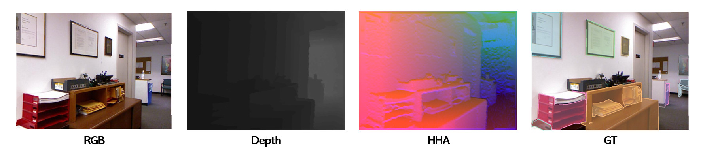

# NYUDv2-IS
A dataset converted from NYUDv2 into COCO-style instance segmentation format


```
Train   : 795 images
Val     : 654 images
Classes : 9
Size    : 640 × 480
Sensor  : Kinect V1
```

## Data preparation

```
NYUDv2/
└── train/
    └── color/
└── val/
    └── color/
└── annotations/
    └── instances_train.json
    └── instances_val.json
└── depth/
└── hha/
```

## Data Format
```
annotation{
    "id": int,
    "image_id": int,
    "category_id": int,
    "segmentation": [polygon],
    "area": float,
    "bbox": [x,y,width,height],
    "iscrowd": 0 or 1,
}

categories[{
    "id": int,
    "name": str,
    "supercategory": str,
}]
```
